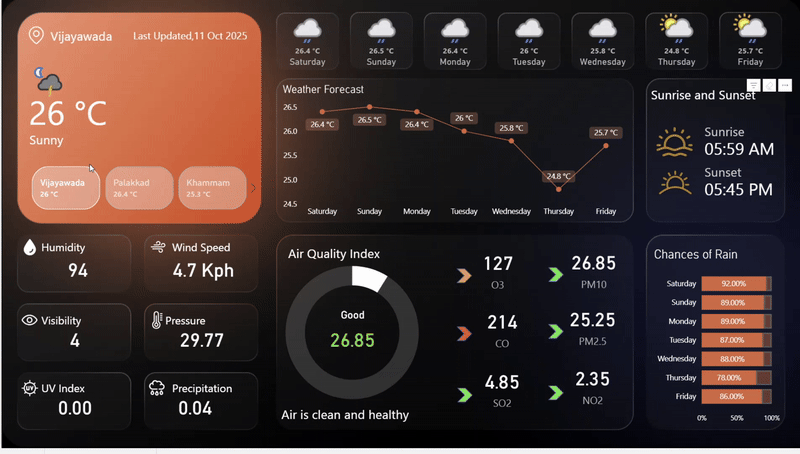

# Power BI Live Weather Dashboard

    

This repository contains a Power BI project for a dynamic, real-time weather dashboard. The report connects to a live weather API to fetch and display current weather conditions, a 7-day forecast, and detailed air quality information for multiple cities.

## ✨ Dashboard Features

* **Dynamic City Slicer:** A horizontal slicer to select and view data for different cities, which also displays the current temperature for each.
* **Current Conditions:** A detailed card showing the selected city's:
    * Current Temperature
    * Weather Condition (e.g., "Partly Cloudy")
    * Dynamic Weather Icon
    * "Last Updated" Timestamp
* **Key Weather Metrics:** A panel of KPIs for current:
    * Wind Speed
    * Pressure
    * Visibility
    * Humidity
* **7-Day Forecast:**
    * A visual slicer showing the icon, day name, and average temperature for the next 7 days.
    * A line chart visualizing the temperature trend over the forecast period.
* **Sunrise & Sunset:** Displays the sunrise and sunset times for the selected day.
* **Chance of Rain:** A custom-built donut chart showing the probability of rain.
* **Air Quality Index (AQI):**
    * KPIs for various pollutants (CO, PM10, O3, etc.).
    * **Conditional Indicators:** Dots that dynamically change color (Green, Yellow, Red) based on pollution levels.
    * A dynamic status (e.g., "Good," "Unhealthy") and a corresponding health suggestion based on the AQI.

## 🚀 How to Use

1.  Clone this repository.
2.  Open the `.pbix` file in Power BI Desktop.
3.  To refresh the data with live information, you will need to:
    * Sign up for your own free API key at [weatherapi.com](https://www.weatherapi.com/).
    * In Power BI, go to `Transform data` to open the Power Query Editor.
    * Select one of the city queries (e.g., "Weather Report 1").
    * Click on the `Source` step and replace the API key in the URL with your own key.
    * Repeat this for all other city queries.
4.  Click **Close & Apply** in the Power Query Editor.
5.  Click **Refresh** on the Home ribbon in Power BI Desktop to fetch the latest data.

## 📺 Project Reference

[The-Developer-BI](https://www.youtube.com/@The-Developer-BI)